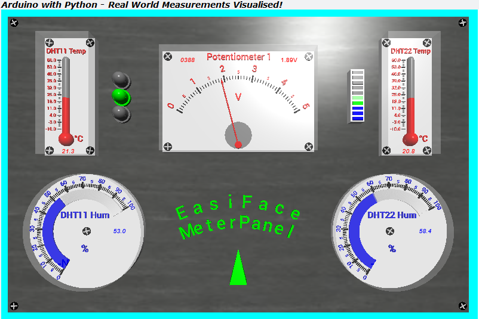

# TTB-AP-Lesson9
My Solution to Paul McWhorter's "Arduino with Python: LESSON 9" homework.

Visit Paul's video here:
 - https://youtu.be/watch?v=tJw8JEX89eo

You can get Paul's code here:
 - https://toptechboy.com/

You can see my solution demonstrated here:
 - https://youtu.be/bFDFTPhdNVM

My Arduino sketch uses some "poor man" multitasking with "millis()" and the Python code now has LEDs and an LED bank.

## My EasiFace Meter Panel - All OK:

